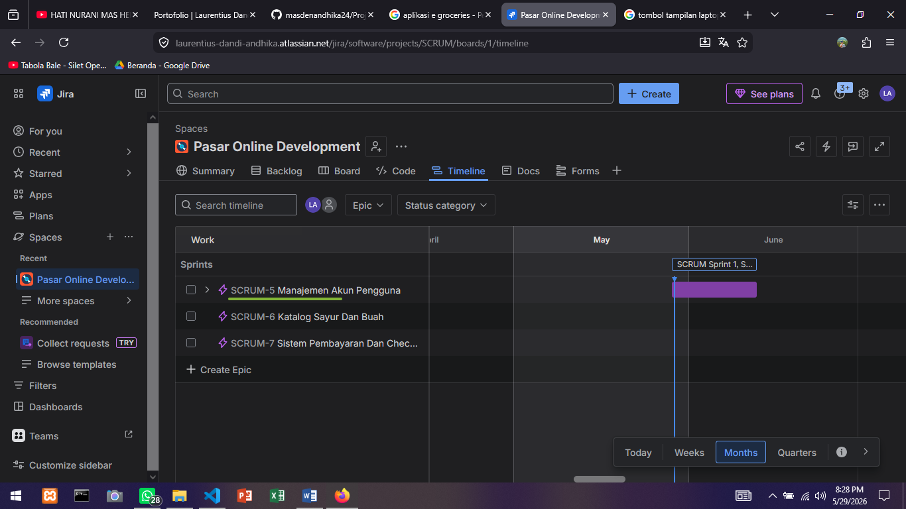
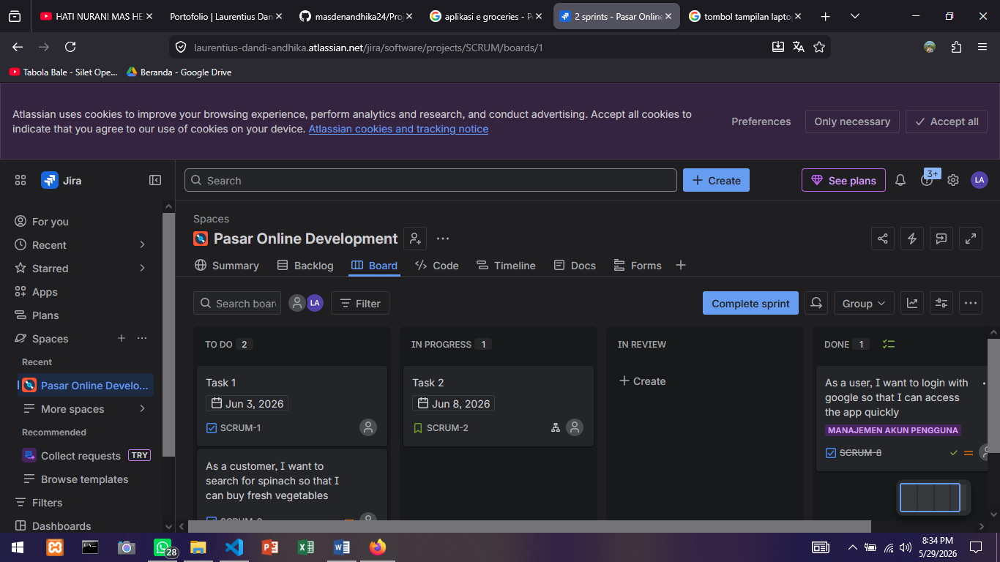

# 🛒 Studi Kasus: Manajemen Proyek Agile & Pengembangan Software E-Groceries Menggunakan Jira

## 📌 1. Ringkasan Proyek (Project Overview)
Proyek ini merupakan simulasi komprehensif mengenai penerapan metodologi **Agile Scrum** dalam merencanakan, mengelola, dan mengeksekusi pengembangan aplikasi belanja sayur online (e-groceries) bernama **"Pasar Online"**. 

Tujuan utama dari proyek ini adalah mendemonstrasikan kemampuan ujung-ke-ujung (*end-to-end*) dalam menyelaraskan strategi produk jangka panjang (*Product Management*) dengan eksekusi teknis harian tim pengembang (*Software Development*) menggunakan platform industri standar, **Jira Software**.

* **Peran Saya:** Product Manager / Scrum Master / Developer (Hybrid Role)
* **Platform yang Digunakan:** Jira Cloud (Atlassian)
* **Metodologi:** Agile Scrum

---

## 🗺️ 2. Fase Perencanaan & Strategi Produk (Product Management)
Sebagai langkah awal, saya berperan sebagai Product Manager untuk memetakan arah strategis produk ke dalam bentuk komponen besar yang disebut **Epic**. Fitur-fitur besar ini dirancang untuk menjawab kebutuhan utama bisnis dan pengguna pada rilis fase awal aplikasi.

### Epic yang Berhasil Dibuat:
1. **Manajemen Akun Pengguna:** Berfokus pada sistem registrasi, keamanan, dan kemudahan akses masuk aplikasi.
2. **Katalog Sayur dan Buah:** Berfokus pada pengalaman pengguna dalam mencari dan melihat ketersediaan produk segar.
3. **Sistem Pembayaran dan Checkout:** Berfokus pada alur transaksi dan integrasi gerbang pembayaran.

### 🖼️ Product Roadmap Timeline

---

## 📋 3. Fase Pengelolaan Backlog & Penulisan User Stories
Setelah menetapkan visi besar pada Roadmap, saya memecah Epic tersebut menjadi tugas-tugas teknis yang lebih kecil dan terukur (*User Stories*) di dalam menu **Backlog**. Penulisan *User Story* ini menggunakan standar industri internasional yang berorientasi pada kebutuhan pengguna (*User-Centric*):

* **User Story 1 (Fitur Login):** 
  > *"As a user, I want to login with Google so that I can access the app quickly."* (ID Tiket: SCRUM-8). Tugas ini berhasil dihubungkan di bawah induk Epic: **Manajemen Akun Pengguna**.
* **User Story 2 (Fitur Pencarian):** 
  > *"As a customer, I want to search for spinach so that I can buy fresh vegetables."* (ID Tiket: SCRUM-9). Tugas ini dihubungkan di bawah induk Epic: **Katalog Sayur dan Buah**.

---

## 🚀 4. Fase Eksekusi & Pemantauan (Software Development)
Untuk memulai siklus pengembangan, saya merencanakan **SCRUM Sprint 1** dengan durasi kerja 2 minggu. Kedua *User Stories* di atas dimasukkan ke dalam ruang lingkup Sprint. Selama siklus berjalan, saya bertindak sebagai pengembang untuk memperbarui status pekerjaan secara transparan melalui papan visual (*Scrum Board*).

* **Alur Kerja Papan (Workflow):** `To Do` ➔ `In Progress` ➔ `In Review` ➔ `Done`.
* **Eksekusi Fitur Login (SCRUM-8):** Kartu tugas berhasil dipindahkan secara bertahap dari tahap perencanaan hingga berhasil diselesaikan (*Done*) 100%.

### 🖼️ Scrum Board Execution

---

## 📊 5. Pelaporan Analitik & Kesimpulan (Reporting)
Pada akhir siklus, saya memanfaatkan dasbor internal Jira pada menu **Summary** untuk meninjau efisiensi kerja dan komposisi proyek. Berdasarkan data grafik riil yang dihasilkan oleh sistem:

* **Penyelesaian Tugas:** Fitur prioritas tinggi berhasil dirilis sesuai dengan komitmen Sprint kerja tanpa hambatan (*blocker*) yang berarti.
* **Analisis Distribusi Pekerjaan:** Grafik analitik menunjukkan porsi kerja tim didominasi oleh pengerjaan *Epic* sebesar 38% yard dan *Task* dasar sebesar 25%, mencerminkan fokus pengerjaan yang seimbang antara arsitektur besar dan fungsionalitas aplikasi.

### 🖼️ Jira Project Summary & Analytics

---

Melalui proyek simulasi ini, saya berhasil membuktikan kompetensi praktis dalam mengoperasikan Jira Software, memahami siklus hidup pengembangan perangkat lunak (*SDLC*), serta menerapkan prinsip *Agile* secara nyata untuk menghasilkan produk yang terstruktur dan terukur.
